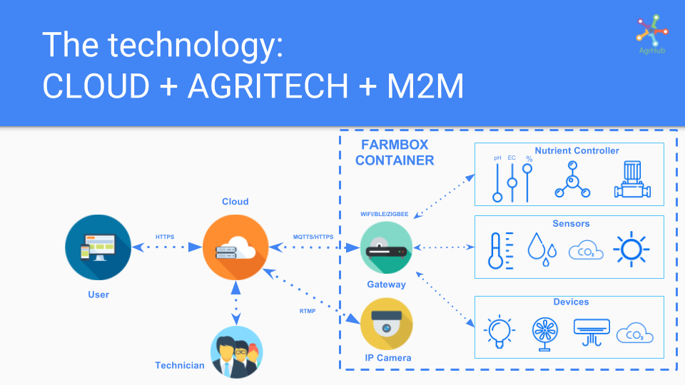
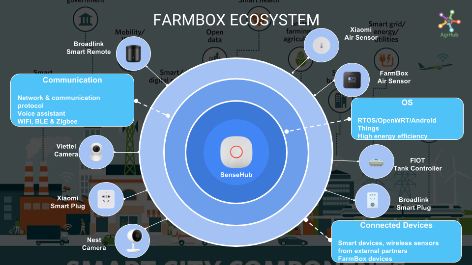
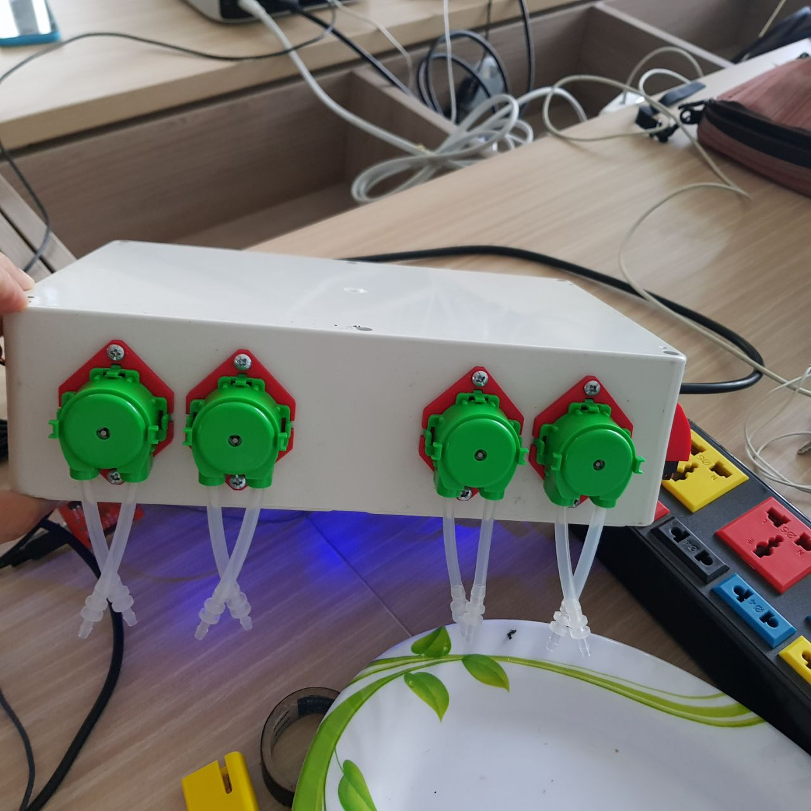
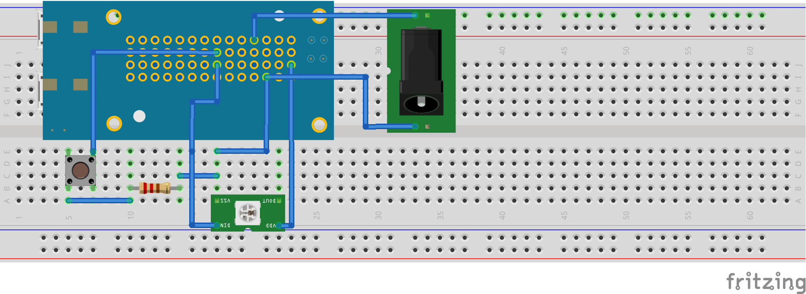

# Sense Hub Android Things

Sense Hub Gateway is an important bridge between farm and end user. It's a wireless device to help collect data from the wireless sensors, which are installed on the farm such as light, air temperature, air humidity, soil humidity, soil nutrient, water pH, water EC ... The data is sent to our server by WiFi connection. On the server, the data is aggregated and also combined with the plant profile data to make decision turn on, turn off or control the devices on the farm such as lamp, water pump, misting pump, fan and air conditioner by automatically. The output from aggregation is sent to Sense Hub Gateway by MQTT to control the local devices on the farm.

## Features

- Web server dashboard configuration
- Get data from bluetooth low energy (BLE) sensor
- Control WiFi device: smart plug, smart remote, smart hydroponic controller, smart humidify...
- MQTT
- OTA and remote update


## Supported Devices


### BLE devices

- [MiFlora sensor](https://www.aliexpress.com/item/Original-English-Version-Mi-Flora-Monitor-Xiaomi-Flower-Care-Monitor-Soil-Water-Test-Machine-For-Garden/32804998987.html)
- [Axaet air sensor](https://www.alibaba.com/product-detail/AXAET-Wireless-Proximity-ibeacon-BLE-temperature_60668543075.html)
- [TI SensorTag](http://www.ti.com/ww/en/wireless_connectivity/sensortag/)
- [nRF51822 Sensor Module](https://www.aliexpress.com/item/nRF51822-Bluetooth-4-0-BLE-SOC-Temperature-Atmospheric-Pressure-Acceleration-Sensor-Module-Gyroscope-Light-Sensor-MPU6050/32816579479.html)
- ...
### WiFi device

- [Broadlink SP mini 3](https://www.aliexpress.com/item/Broadlink-SP-Mini-Smart-Wireless-Remote-Control-Socket-Power-Supply-Plug-Wifi-Plug-timer-extender-time/32223307784.html)
- [Broadlink RM mini 3](https://www.aliexpress.com/item/Broadlink-RM2-RM-PRO-Smart-Home-Automation-WiFi-IR-RF-Universal-Intelligent-Wireless-remote-Controller-for/32729931353.html)
- FIOT smart hydroponic controller

- ...
## Pre-requisites

- Android Things compatible board
- Android Studio 2.2+
- 1 [WS2812B compatible RGB Led strip](https://www.adafruit.com/product/1612)
- 1 [Push-button](https://www.adafruit.com/product/1400)

## Schematics



## Issues
- Sense Hub supports configuring SSID and password your home wifi by dashboard. Currently, Android Things doesn't support SoftAP right now, user must configure internet for gateway by command line.
> adb shell am startservice -n com.google.wifisetup/.WifiSetupService -a WifiSetupService.Connect -e ssid your-ssid -e passphrase your-password
- Google Cloud IoT Core doesn't support subscribe a topic for receiving data from server right now. If you want to control device from mobile apps, you must use an other MQTT server.
- We met some issue with Android Things to send the UDP packet to Broadlink device. We are trying to fix issue soon

## Build and install

Before building, you must configure MQTT server configuration.
For Google IoT Core service, open file /app/assets/config/config_iot_core.properties and edit
> PROJECT_ID=your-project-id
DEVICE_ID=your-device-id
CLOUD_REGION=your-region
REGISTRY_ID=your-registry-id
MQTT_HOSTNAME=mqtt.googleapis.com
MQTT_PORT=8883

For other MQTT server, open file /app/assets/config/config_mqtt.properties and edit
> MQTT_HOSTNAME=your-mqtt-ip-server
MQTT_PORT=your-mqtt-port
MQTT_USERNAME=your-mqtt-username
MQTT_PASSWORD=your-mqtt-password

On Android Studio, click on the "Run" button.
If you prefer to run on the command line, type
```bash
./gradlew installDebug
adb shell am start com.agrhub.sensehub.activity/.MainActivity
```

If you have everything set up correctly:
- You can go to the local web dashboard (http://<android-things-board-ip-address>:8433) to view sensor data and control WiFi devices.
- If a Google Cloud Platform project is configured (see instruction below), it will publish the sensor data to Google Cloud PubSub.
- The structure of data sends to MQTT server as below. Depend on your purpuse, you can parse and get data on server.
> data={"gateway_mac_address":"24:0A:C4:81:8A:B0","gateway_name":9,"gateway_type":4,"timestamp":1509465829000,"freemem":56860,"devices":[{"device_name":4,"device_type":1,"device_state":0,"device_mac_address":"c4:7c:8d:63:7b:90","data":[{"sensor_type":12,"sensor_value":73},{"sensor_type":2,"sensor_value":27},{"sensor_type":1,"sensor_value":65},{"sensor_type":5,"sensor_value":82},{"sensor_type":6,"sensor_value":2838}]},{"device_name":1,"device_type":2,"device_state":0,"device_mac_address":"34:ea:34:f5:f0:6a","data":[{"controller_type":0,"controller_is_on":true}]}]}

Detailed information about "device_name", "device_type", "controller_type", "sensor_type", please review in package com.agrhub.sensehub.components.util

## Google Cloud Platform configuration (optional)

0. Go to your project in the [Google Cloud Platform console](https://console.cloud.google.com/)
0. Under *API Manager*, enable the following APIs: Cloud Pub/Sub
0. Under *IAM & Admin*, create a new Service Account, provision a new private key and save the generated json credentials.
0. Under *Pub/Sub*: create a new topic and in the *Permissions* add the service account created in the previous step with the role *Pub/Sub Publisher*.
0. Under *Pub/Sub*: create a new *Pull subscription* on your new topic.
0. Config Google IoT Core, please review Google IoT Core document https://cloud.google.com/iot/docs/how-tos/devices
0. Import the project into Android Studio. Update public and private authentication key for IoT Core in directory app/assets/keys/rsa_cert.pem (public key) and app/assets/keys/rsa_private.pem (private key). 
0. In `app/build.gradle`, replace the `buildConfigField` values with values from your project setup.

## Next steps

Now your weather sensor data is continuously being published to [Google Cloud Pub/Sub](https://cloud.google.com/pubsub/):
- process weather data with [Google Cloud Dataflow](https://cloud.google.com/dataflow/) or [Google Cloud Functions](https://cloud.google.com/functions/)
- persist weather data in [Google Cloud Bigtable](https://cloud.google.com/bigtable/) or [BigQuery](https://cloud.google.com/bigquery/)
- create some weather visualization with [Google Cloud Datalab](https://cloud.google.com/datalab/)
- build weather prediction model with [Google Cloud Machine Learning](https://cloud.google.com/ml/)

## License

[GNU General Public License v3.0](https://github.com/dmtan90/Sense-Hub-Android-Things/blob/master/LICENSE)

If you have any question or want to cooperate with us, please contact us by email dmtan@agrhub.com.
